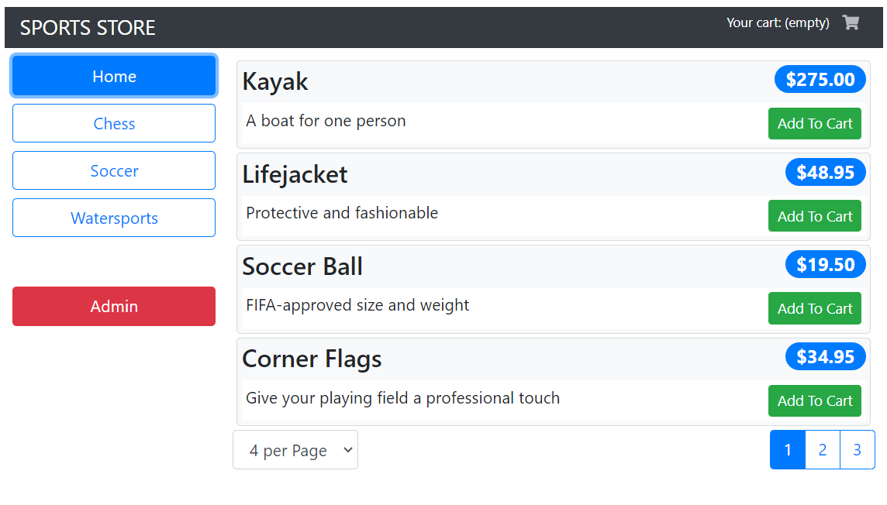
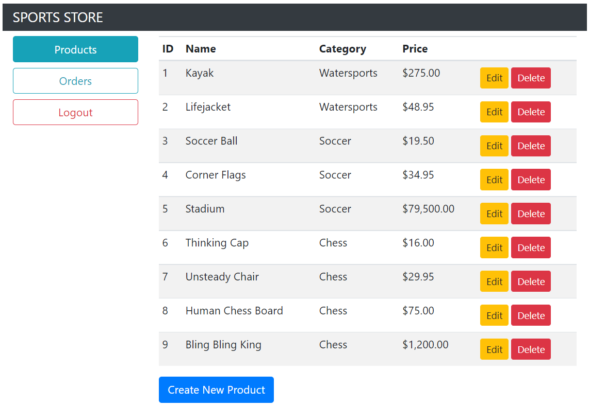

# Sports Store

---

### Description
A shoping cart application made following along "Pro Angular 9 - Build powerful and Dynamic Web Apps" book from author Adam Freeman. Nice app made learning Angular, complete checkout process made and admin features.

---

## Use

To run the application you need to run npm install to get the needed packages, 
`npm run json` to run the backend. This is configured to run in the port 3500. Go to http://localhost:3500/products to confirm it is working. To run the frontend `ng serve -o` will open in browser.
To access to admin features the credentials are hardcoded in the file authMiddleware.js.

Admin Panel: 

---

## Technologies

- Angular
- Type Script
- Bootstrap
- Node, Express, JWT

---

## Author Info

- Linkedin - [Federico Andrés Jácome Castañeda](https://www.linkedin.com/in/federicojacome/)
- Website - [To be added](https://github.com/federocky)

[Back To The Top](#read-me-template)
